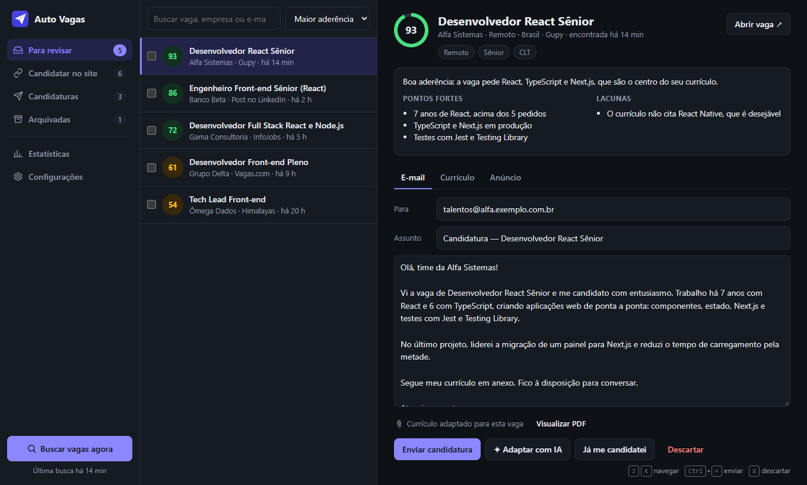
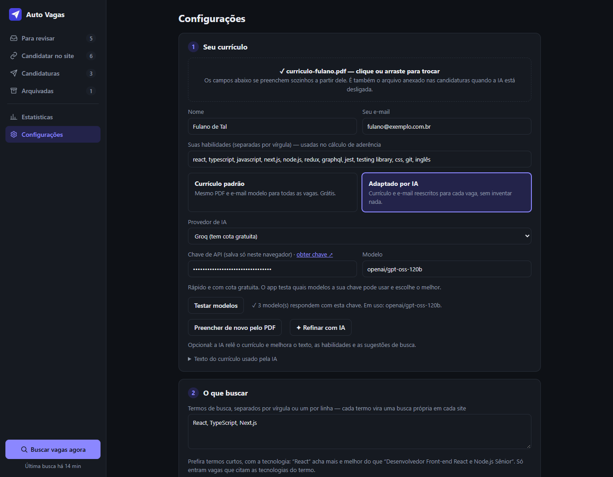
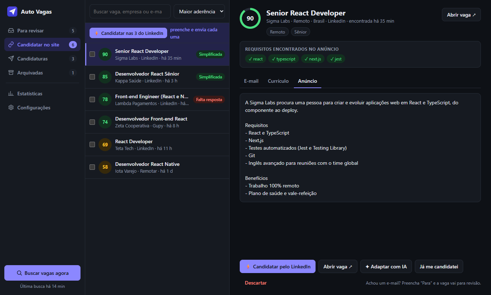
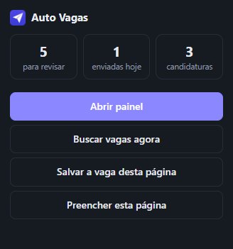

# Auto Vagas

Extensão gratuita e de código aberto para o Google Chrome que procura vagas, prepara cada candidatura com o seu currículo (o padrão ou um adaptado por IA) e se candidata por você: por e-mail, pelo seu Gmail, ou no próprio LinkedIn, nas vagas de Candidatura simplificada. Também funciona no Brave e no Edge.



## Por que existe

É a ferramenta que eu gostaria de encontrar se estivesse desempregado e sem dinheiro para pagar uma IA. Procurar vaga já cansa, e pagar assinatura justo quando o dinheiro falta não faz sentido. Por isso tudo aqui pode ser usado de graça:

- **Busca sem chave e sem conta**: os sites de vagas são consultados direto do seu navegador.
- **IA gratuita**: a Groq tem cota gratuita e a OpenCode Zen tem modelos gratuitos. A extensão testa quais modelos a sua chave pode usar e escolhe o melhor. OpenAI e Anthropic (Claude) também funcionam, se você já tiver uma chave.
- **Envio pelo seu Gmail**, pela API oficial do Google, sem custo.
- **Sem servidor no meio**: currículo, chaves e respostas ficam no seu navegador. O texto do currículo só sai dele para o provedor de IA que você escolher, e só quando a IA está ligada.

## Como instalar

1. Baixe o código: **Code → Download ZIP** nesta página e descompacte, ou `git clone https://github.com/gglucche/auto-vagas.git`.
2. No Chrome, abra `chrome://extensions`.
3. Ligue o **Modo do desenvolvedor**, no canto superior direito.
4. Clique em **Carregar sem compactação** e escolha a pasta descompactada (`auto-vagas` ou `auto-vagas-main`).

O painel abre sozinho. Fixe o ícone da extensão na barra para voltar a ele depois. No Brave e no Edge o caminho é o mesmo, em `brave://extensions` e `edge://extensions`.

Para atualizar, troque os arquivos da pasta (`git pull`, ou o ZIP novo no mesmo lugar) e aperte F5 no painel: ele recarrega a extensão sozinho. Para isso o Modo do desenvolvedor precisa continuar ligado.

### Primeira configuração

Tudo fica em **Configurações**, em quatro passos:

1. **Seu currículo**: arraste o PDF e nome, e-mail, habilidades e termos de busca se preenchem sozinhos. Escolha **Currículo padrão** ou **Adaptado por IA**. Para a IA, cole a chave do provedor e clique em **Testar modelos**.
2. **O que buscar**: termos curtos separados por vírgula, como `React, TypeScript, Next.js`, a localização e se a vaga precisa ser remota.
3. **Envio pelo Gmail** (opcional): a própria tela mostra o passo a passo no Google Cloud. Ative a Gmail API, crie um cliente OAuth do tipo **Aplicativo da Web** com o endereço de retorno que o painel mostra e cole o ID do cliente. Sem isso, **Enviar** abre o Gmail com tudo preenchido e baixa o currículo para você anexar.
4. **Candidatura no site**: celular, cidade, anos de experiência por tecnologia, pretensão salarial e nível de inglês. São as respostas usadas nos formulários do LinkedIn.



## Como funciona

**Busca.** Cada termo vira uma consulta no LinkedIn, Gupy, InfoJobs, Vagas.com, Remotar e Himalayas, feita direto por HTTP: não abre aba e não usa a sua conta. Ficam só as vagas que citam as tecnologias do termo, dos últimos 45 dias, sem repetição entre os sites. Roda no botão **Buscar vagas agora** ou sozinha a cada 3, 6, 12 ou 24 horas.

**Para revisar.** Vagas com e-mail de contato. Cada uma chega com a nota de aderência ao seu currículo, o e-mail escrito e o currículo anexado. Confira e clique em **Enviar candidatura**, ou ligue o **Piloto automático**, que envia sozinho dentro do limite diário e da aderência mínima que você escolher.

**Candidatar no site.** Vagas sem e-mail, que são a maioria. Nas de Candidatura simplificada do LinkedIn, **⚡ Candidatar** abre a vaga em uma janela, passa pelas etapas, anexa o currículo e envia. O botão do topo faz todas, uma depois da outra. A extensão não inventa respostas: uma pergunta que ela não sabe interrompe aquela candidatura e aparece em Configurações, para você responder uma vez só.



**Candidaturas.** O que já foi enviado, com a etapa de cada uma (Aguardando, Responderam, Entrevista, Oferta, Recusada) e o lembrete de follow-up.

**Outros sites.** No formulário de candidatura de qualquer site, clique no ícone da extensão e em **Preencher esta página**. Ela preenche o que souber; você confere e envia.



> O LinkedIn não permite automação nos termos de uso e pode restringir contas que exageram. Por isso há um limite diário de candidaturas (20, ajustável), pausa entre elas e a opção de parar antes de enviar, para conferir.

## Como ajudar

- **Compartilhe** com quem está procurando emprego. É para isso que o projeto existe.
- Achou um problema ou quer outro site de vagas? Abra uma [issue](https://github.com/gglucche/auto-vagas/issues).
- Pull requests são bem-vindos. Abaixo, como rodar os testes.

## Desenvolvimento

Não há etapa de build: o navegador carrega a pasta como está. Ao mudar o código de fundo, suba a versão em `manifest.json` e em `lib/build.js`, sempre iguais.

```bash
node dev/test.mjs          # testes com a API chrome.* simulada
node dev/test-pdf.mjs      # leitura do PDF do currículo
node dev/test-browser.mjs  # a extensão instalada em um Chrome, Brave ou Edge sem janela
node dev/server.mjs        # o painel em http://localhost:5178, com dados de exemplo
node dev/screenshots.mjs   # refaz as imagens deste README
```

## Licença

[MIT](LICENSE): use, copie e adapte à vontade.
